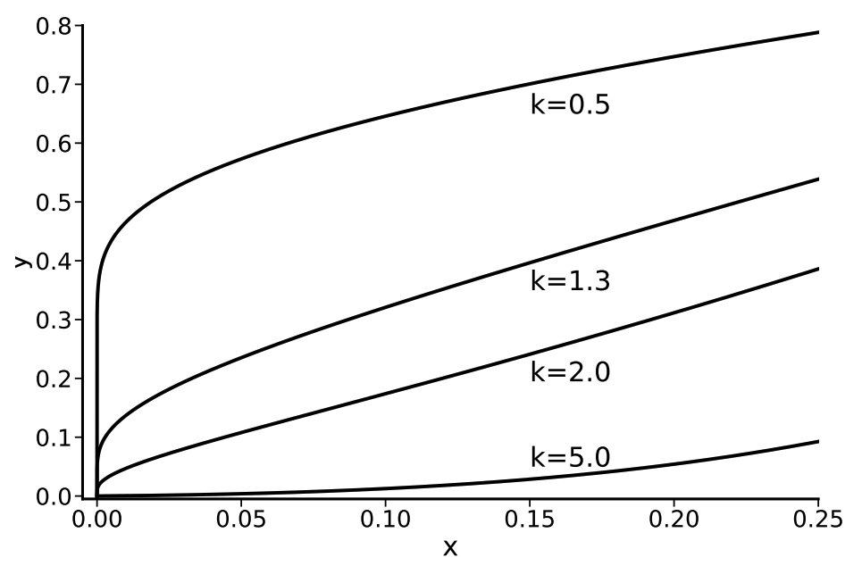

# [ICML 2022] Channel Importance Matters in Few-Shot Image Classification

Paper link: https://arxiv.org/abs/2206.08126

## Abstract

Few-Shot Learning (FSL) requires vision models to quickly adapt to brand-new classification tasks with a shift in task distribution. Understanding the difficulties posed by this task distribution shift is central to FSL. In this paper, we show that a simple channel-wise feature transformation may be the key to unraveling this secret from a channel perspective. When facing novel few-shot tasks in the test-time datasets, this transformation can greatly improve the generalization ability of learned image representations, while being agnostic to the choice of training algorithms and datasets. Through an in-depth analysis of this transformation, we find that the difficulty of representation transfer in FSL stems from the severe channel bias problem of image representations: channels may have different importance in different tasks, while convolutional neural networks are likely to be insensitive, or respond incorrectly to such a shift. This points out a core problem of the generalization ability of modern vision systems and needs further attention in the future.



## Updates

We have added the extended version of oracle transformation in each classifier. Compared to the version in our ICML paper, the extended version additionally supports features taking negative values. So any pretrained backbone can be tested, including ResNets using LeakyReLU or variants of ViT like SwinTransformer. We will include the extended version and far more analysis about feature importance of visual representions in an extended paper. If you have any problem, please open an issue or just contact the author Xu Luo through the email.


## Where to find the simple channel-wise transformtion

The single-line `simple_transform` function has been put inside each test-time classifier, e.g., see in `architectures/classifier/proto_head.py`.


## Installation
A list of packages to install is available in `requirements.txt`, just install them using command:

```install
pip install -r requirements.txt
```

## Checkpoints of backbones

All 11 pre-trained models in Table 1 of our paper can be found [here](https://drive.google.com/drive/folders/17IW2VQt_Tu2fAwcL_gMoyYX9pf5YHkQR?usp=sharing). We use [LightningFSL](https://github.com/Frankluox/LightningFSL) to train all backbones. For training the models, please refer to it.

## Evaluate the simple channel-wise feature transformation

After obtaining pre-trained models and downloading needed datasets (see below), one can evaluate the simple channel-wise feature transformation. Exemplar commands for running the code can be found in `eval.sh`.

## Download test-time datasets 

Download any of the 19 test-time datasets in Table 1 of our paper for evaluation. 

- miniImageNet: Download and extract [miniimagenet.tar](https://docs.google.com/uc?export=download&id=191cFzwwNTzG_mHUDABF0Nh77cI6pa-qq), and use the resultant folder as the root directory.
- CUB: Download and extract [cub.tar](https://docs.google.com/uc?export=download&id=1B8jmZin9teye7Lte9ZKsQ3lyMASbxune), and use the `images/` folder as the root directory.
- Textures: Download and extract [dtd-r1.0.1.tar.gz](https://www.robots.ox.ac.uk/~vgg/data/dtd/download/dtd-r1.0.1.tar.gz), and use the `images/` folder as the root directory.
- Traffic Signs: Download and extract [GTSRB_Final_Training_Images.zip](https://sid.erda.dk/public/archives/daaeac0d7ce1152aea9b61d9f1e19370/GTSRB_Final_Training_Images.zip), and use the `Final_Training/Images/` folder as the root directory.
- Aircraft: Download and extract [fgvc-aircraft-2013b.tar.gz](http://www.robots.ox.ac.uk/~vgg/data/fgvc-aircraft/archives/fgvc-aircraft-2013b.tar.gz), and use the `fgvc-aircraft-2013b/data` folder as the root directory.
- Omniglot: Download [images_background.zip](https://github.com/brendenlake/omniglot/raw/master/python/images_background.zip) and [images_evaluation.zip](https://github.com/brendenlake/omniglot/raw/master/python/images_evaluation.zip), then extract them into the same directory as the root directory.
- VGG Flower: Download [102flowers.tgz](http://www.robots.ox.ac.uk/~vgg/data/flowers/102/102flowers.tgz)
    and [imagelabels.mat](http://www.robots.ox.ac.uk/~vgg/data/flowers/102/imagelabels.mat), then extract 102flowers.tgz, and put them into the same directory as the root directory.
- MSCOCO: Download [val2017.zip](http://images.cocodataset.org/zips/val2017.zip) and [annotations_trainval2017.zip](http://images.cocodataset.org/annotations/annotations_trainval2017.zip), then extract them into the same directory as the root directory.
- Quick Draw: Download and extract [quickdraw.zip](http://csr.bu.edu/ftp/visda/2019/multi-source/quickdraw.zip), and use the resultant folder as the root directory.
- Fungi: Download and extract [fungi_train_val.tgz](https://labs.gbif.org/fgvcx/2018/fungi_train_val.tgz), and use the `images/` folder as the root directory.
- Plant Disease: Download from [kaggle](https://www.kaggle.com/saroz014/plant-disease/), and use the train split as the root directory.
- ISIC: Download [ISIC2018_Task3_Training_Input.zip](https://isic-challenge-data.s3.amazonaws.com/2018/ISIC2018_Task3_Training_Input.zip) and [ISIC2018_Task3_Training_GroundTruth.zip](https://isic-challenge-data.s3.amazonaws.com/2018/ISIC2018_Task3_Training_GroundTruth.zip), then extract them into the same directory as the root directory.
- EuroSAT: Dowaload and extract [EuroSAT.zip](http://madm.dfki.de/files/sentinel/EuroSAT.zip), and use the resultant folder as the root directory.
- ChestX: Download from [kaggle](https://www.kaggle.com/nih-chest-xrays/data), and use the resultant folder as the root directory.
- Real: Download and extract [real.zip](http://csr.bu.edu/ftp/visda/2019/multi-source/real.zip), and use the resultant folder as the root directory.
- Sketch: Download and extract [sketch.zip](http://csr.bu.edu/ftp/visda/2019/multi-source/sketch.zip), and use the resultant folder as the root directory.
- Infograph: Download and extract [infograph.zip](http://csr.bu.edu/ftp/visda/2019/multi-source/infograph.zip), and use the resultant folder as the root directory.
- Painting: Download and extract [painting.zip](http://csr.bu.edu/ftp/visda/2019/multi-source/painting.zip), and use the resultant folder as the root directory.
- Clipart: Download and extract [clipart.zip](http://csr.bu.edu/ftp/visda/2019/multi-source/clipart.zip), and use the resultant folder as the root directory.

## Citation

If you find our work useful in your research please consider citing:

```
@inproceedings{
Luo2022Channel,
title={Channel Importance Matters in Few-Shot Image Classification},
author={Luo, Xu and Xu, Jing and Xu, Zenglin},
booktitle={International Conference on Machine Learning},
year={2022},
}
```

## Acknowlegements

Part of the code is from [RFS](https://github.com/WangYueFt/rfs) and [DeepEMD](https://github.com/icoz69/DeepEMD) repo.
